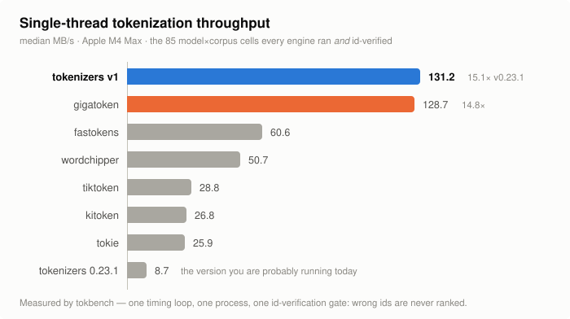

<p align="center">
    <br>
    
    <br>
<p>
<p align="center">
    <a href="https://github.com/huggingface/tokenizers/actions"></a>
    <a href="https://crates.io/crates/tokenizers"></a>
    <a href="https://docs.rs/tokenizers/"></a>
    <a href="#footprint"></a>
    <a href="https://github.com/huggingface/tokenizers/blob/main/LICENSE"></a>
</p>

The fastest tokenizer library on the world's text, and the only fast one that runs **every** model
— BPE, Unigram, WordPiece and WordLevel, from one `tokenizer.json`. Tokenization should be light
and should scale with your workflow: your GPUs should never sit idle waiting on the CPU.

**v1 is in release candidate.** `1.0.0-rc.0` is on crates.io and PyPI, and the write-up with the
full measurement set is here: **[tokenizers v1](https://huggingface-tokenizers-v1.static.hf.space/index.html)**.

<p align="center">
  <a href="https://huggingface-tokenizers-v1.static.hf.space/index.html">
    
  </a>
</p>

# To come for v1

The rc ships the fast path: load a `tokenizer.json`, encode, decode, batch. What is **not** back
yet is the part of the old API that let you *assemble* a tokenizer from its components. Today the
Python package exports exactly three classes — `Tokenizer`, `Encoding`, `Padding`. Restoring the
component surface on the new pipeline is the remaining v1 work.

### The target API

```python
from tokenizers import Tokenizer, decoders, models, normalizers, pre_tokenizers, processors

tokenizer = Tokenizer(models.BPE())

# every stage is an assignable attribute, as in 0.x
tokenizer.normalizer = normalizers.Sequence([normalizers.NFD(), normalizers.Lowercase()])
tokenizer.pre_tokenizer = pre_tokenizers.ByteLevel(add_prefix_space=False)
tokenizer.model = models.BPE.from_file("vocab.json", "merges.txt")
tokenizer.post_processor = processors.TemplateProcessing(
    single="[CLS] $A [SEP]",
    special_tokens=[("[CLS]", 1), ("[SEP]", 2)],
)
tokenizer.decoder = decoders.ByteLevel()

# and reading one back
tokenizer.pre_tokenizer            # -> ByteLevel(add_prefix_space=False)
```

Training comes back with it:

```python
from tokenizers.trainers import BpeTrainer

trainer = BpeTrainer(special_tokens=["[UNK]", "[CLS]", "[SEP]", "[PAD]", "[MASK]"])
tokenizer.train(files=["wiki.train.raw", "wiki.valid.raw"], trainer=trainer)
tokenizer.save("tokenizer.json")
```

### What the rc actually gives you today

```python
from tokenizers import Tokenizer

tokenizer = Tokenizer.from_pretrained("meta-llama/Llama-3.1-8B")   # or .from_file(path)

tokenizer.encode("Hello, y'all! How are you 😁 ?")   # -> Encoding
tokenizer.encode_batch([...])
tokenizer.tokenize("Hello")                          # -> ["Hello"]
tokenizer.decode([15339, 1917])
tokenizer.decode_tokens(encoding)
tokenizer.padding = None                             # get/set padding
```

### Remaining before 1.0.0

- 🚧 clean up legacy code
- 🚧 reduce redundant CI benchmarks by comparing against `main` only

### After 1.0.0

- `tk-devices` — exploratory GPU encoding and batch decoding that keeps text and ids on the
  device: upload the vocabulary once, compute output positions in parallel, gather the bytes on the
  GPU. An optional component aimed at large batches, subject to prototyping and measurement.

Already landed for the rc: the workspace split, `bitsplit` (bitstream pre-tokenization replacing
the regex and then the FSMs, [#2201](https://github.com/huggingface/tokenizers/pull/2201)
[#2317](https://github.com/huggingface/tokenizers/pull/2317)), the `WordCache`
([#2262](https://github.com/huggingface/tokenizers/pull/2262)), `FlatCache` / MPHF `RankStore` /
incremental merging / `BucketVocabStore`
([#2190](https://github.com/huggingface/tokenizers/pull/2190)
[#2188](https://github.com/huggingface/tokenizers/pull/2188)), scratch-buffer model state
([#2175](https://github.com/huggingface/tokenizers/pull/2175)
[#2183](https://github.com/huggingface/tokenizers/pull/2183)), `STAGE_POST` post-processing
([#2182](https://github.com/huggingface/tokenizers/pull/2182)), batched model calls
([#2304](https://github.com/huggingface/tokenizers/pull/2304)) and the rewritten decoder.

## Performance

Single thread, the closest competitor is [gigatoken](https://github.com/marcelroed/gigatoken), and
we are narrowly ahead of it. At 8 threads it is ahead of us.

| single thread | median MB/s | × 0.23.1 |
|---|---:|---:|
| **tokenizers v1** | **131.2** | **15.1×** |
| gigatoken | 128.7 | 14.8× |
| fastokens | 60.6 | 7.0× |
| wordchipper | 50.7 | 5.8× |
| tiktoken | 28.8 | 3.3× |
| kitoken | 26.8 | 3.1× |
| tokie | 25.9 | 3.0× |
| tokenizers 0.23.1 | 8.7 | 1.0× |

Threading is the other story. The curve, 1 → 2 → 4 → 8 workers, on its own smaller cell set
(6 models, English and Chinese — so the 1-thread column here is not the table above):

| | 1 | 2 | 4 | 8 | % of linear |
|---|---:|---:|---:|---:|---:|
| gigatoken | 168 | 296 | 517 | **918** | 72% |
| **tokenizers v1** | 147 | 276 | 473 | 836 | 70% |
| tokie | 52 | 102 | 179 | 327 | 79% |
| wordchipper | 41 | 78 | 144 | 264 | 67% |
| tiktoken | 26 | 52 | 96 | 172 | 83% |
| fastokens | 51 | 82 | 130 | 163 | 39% |
| kitoken | 23 | 45 | 86 | 161 | 85% |
| tokenizers 0.23.1 | 8 | 15 | 27 | 46 | 74% |

That is **15.1×** over `tokenizers` 0.23.1 single thread and **18×** at 8 threads.

**Where we lose:** multi-threaded throughput, and scaling efficiency — 70% of linear against
gigatoken's 72%, and behind `kitoken` (85%), `tiktoken` (83%) and `tokie` (79%), which scale better
from a much lower base. The single-thread lead is 1.9%, which is a lead and not a rout.

### Against 0.23.1, by model and by language

Every model family gets at least **10.9×**, and gpt2 gets **34.5×**:

| model | × | model | × |
|---|---:|---|---:|
| gpt2 | 34.5 | qwen2 | 14.8 |
| llama-3 | 27.9 | minimax | 14.7 |
| glm-5.2 | 22.6 | gpt-oss | 12.0 |
| deepseek-v4 | 15.1 | nemotron-3 | 10.9 |

By corpus, English **29.8×** down to Chinese **6.8×** — Hindi 16.1, Amharic 15.3, Hebrew 14.1,
Bengali 13.4, Greek 12.6, Arabic 12.2, Tamil 11.2, Georgian 11.2, Korean 10.1, Thai 9.6,
Japanese 7.6, Russian 7.1.

### Latency and decode

Short-string latency at 512 bytes, warm, 1000 samples: **2.1–3.6 µs p50** and 3.4–5.7 µs p99
across the eight model families.

Decoding was rewritten to write bytes straight into a reusable buffer: **306–429 MB/s** against
0.23.1's 36–57, a **5.9–8.9×** range.

<sub>Apple M4 Max, one complete report, warm, median of 5. <code>1.0.0-rc.0 (tokenizers-rc0 @
5c3727a9)</code> vs <code>tokenizers 0.23.1</code>. The cross-engine medians are over the cells
<em>every</em> implementation both ran and id-verified — 85 of 176 for single thread (8 models),
10 of 16 at 8 threads (6 models, English and Chinese). The 0.23.1 comparisons are over all
176/176 matched, id-verified model/corpus cells. Full method, per-cell data and the interactive
charts: <a href="https://huggingface-tokenizers-v1.static.hf.space/index.html">the v1
write-up</a>.</sub>

## tokbench

Every number above comes from **[tokbench](https://github.com/huggingface/tokbench)**, a
standalone cross-engine benchmark we built because there was no honest way to compare these
libraries.

It exists to remove the two ways tokenizer benchmarks usually mislead:

- **One timing loop, one process.** Every engine is measured by the same harness on the same bytes,
  rather than each project quoting its own number from its own rig.
- **An id-verification gate.** Every run is hashed and compared against the reference ids. An
  engine that computes *different* ids is marked `mismatch` and is never ranked. Being fast at the
  wrong answer is not a win, and this is where "supports every model" stops being a slogan and
  becomes a column: engines that decline non-Latin scripts, or quietly differ on them, show up as
  declined or mismatched cells instead of as speed.

This also means our own losses are on the page — the 8-thread gap above is tokbench's number, not
a caveat we volunteered. Run it yourself:
[huggingface/tokbench](https://github.com/huggingface/tokbench).

<a name="footprint"></a>
## Footprint

```
make slim-size      # tk-encode + tk-serialize, minsize profile, stripped
                    # → 332799 bytes gzipped
```

Gzipped is the only honest number: Mach-O segments are 16 KiB-quantised, so the on-disk size of a
small binary is mostly padding. `make slimest` goes lower still (`minsize` plus a `std` rebuilt
without unwinding, nightly). The badge at the top is this number, measured on macOS — a stripped
ELF gzips to something slightly different.

## Crates

<details>
<summary><b><code>tk-encode</code></b> — the inference half</summary>

The model engines (BPE, Unigram, WordPiece, WordLevel) and the full pipeline: `Normalizer`,
`PreTokenizer`, `Model`, `PostProcessor`, `Decoder`.

**Why separate:** inference is the only half that ships to production. Splitting it from training
means a serving binary never links a trainer, a corpus reader or a progress bar — which is most of
the 325 KB story.
</details>

<details>
<summary><b><code>bitsplit</code></b> — SIMD pre-tokenization</summary>

Unicode atom classification plus pre-tokenization as a **bitstream program** rather than a scalar
FSM. Follows *Interleaved Bitstream Execution for Multi-Pattern Regex Matching on GPUs*
(MICRO'25, [10.1145/3725843.3756052](https://doi.org/10.1145/3725843.3756052)): compile the grammar
into character-class bitstreams (one bit per input byte) plus boolean ops and carry-propagating
adds, so 64 input bytes are decided per 64-bit register op, branchlessly. The FSM's per-token
unpredictable branch disappears.

Ships byte-exact grammars for gpt2 / ByteLevel, cl100k, o200k, tekken, deepseek and kimi-k2.

**Why separate:** it is a regex compiler, not a tokenizer — an independent artifact with its own
test surface, where every vectorised kernel is validated byte-for-byte against one scalar oracle.
Keeping it out of `tk-encode` is what makes "SIMD is pure speed, never correctness" checkable
rather than aspirational.
</details>

<details>
<summary><b><code>tk-serialize</code></b> — the reader</summary>

`from_json_file` turns a canonical `tokenizer.json` into a `PipelineTokenizer`. **No serde
anywhere.**

**Why separate:** serde's derive chain was a large, unconditional dependency sitting in front of
the one thing every user does exactly once. Reading a config is not the same job as encoding text,
and it should not tax it.
</details>

<details>
<summary><b><code>tk-convert</code></b> — the upgrade pass</summary>

`canonicalize_file` rewrites a `tokenizer.json` written by any older version of this library into
the canonical form the reader accepts. A pure JSON→JSON rewrite; it depends on nothing but
`std::path` and `serde_json`.

**Why separate:** every config ever published stays readable without the runtime carrying a decade
of compatibility branches. `cargo tree -p tk-convert -e normal` is 8 nodes.
</details>

<details>
<summary><b><code>tk-train</code></b> — the training half</summary>

The `Trainer` trait, every concrete `*Trainer`, `TrainerWrapper` and the `Trainable` extension.

**Why separate:** training is a batch job on a workstation; inference is a hot loop in a server.
They have opposite constraints, so they get opposite dependency budgets.
</details>

<details>
<summary><b><code>bitmap_gen</code></b> — dev-only table generator</summary>

`cargo run -p bitmap_gen` regenerates `bitsplit`'s committed classify tables from
`unicode-properties`.

**Why separate:** the Unicode tables are baked and committed, so the generator is never linked into
anything that ships. Not published.
</details>

<details>
<summary><b><code>tokenizers</code></b> — umbrella</summary>

A thin re-export so existing `tokenizers::…` paths keep working. Depend on this one unless you know
you want less.
</details>

## Bindings

| | status |
|---|---|
| [Rust](tokenizers) | ✅ reference implementation |
| [Python](bindings/python) | ✅ |
| [Node.js](bindings/node) | ✅ |
| C / C++ | 🚧 planned |
| [Ruby](https://github.com/ankane/tokenizers-ruby) | community, external repo |

## Hardware

**No SIMD is required.** Every kernel has a portable path that is always compiled and is the
byte-exact test oracle for its vectorised siblings, so correctness never depends on a kernel being
present — only throughput does.

<details>
<summary>Which ops are hardware-adapted</summary>

| op | aarch64 | x86_64 | wasm32 | portable fallback |
|---|---|---|---|---|
| Unicode atom classify | NEON (baseline) | AVX-512 VBMI → SSE4.1/SSSE3, runtime-detected | SIMD128 | `classify_scalar` |
| bitstream block build | NEON | SSE/AVX | — | `build_block_scalar` |
| literal & added-token scan | NEON | x86_64 | — | scalar |
| vocab bucket nibble match | NEON | — | — | scalar |

aarch64 selects at compile time (NEON is baseline). x86_64 dispatches at runtime via
`is_x86_feature_detected!`, so one binary covers every x86_64 CPU since 2008. wasm32 needs the
`simd128` target feature; without it, the scalar walk.
</details>

## Getting it

```bash
pip install --pre tokenizers
```

```toml
[dependencies]
tokenizers = "1.0.0-rc.0"
```

This work stands on a lot of open source. [gigatoken](https://github.com/marcelroed/gigatoken),
[tiktoken](https://crates.io/crates/tiktoken-rs), [kitoken](https://crates.io/crates/kitoken),
[tokie](https://crates.io/crates/tokie), [fastokens](https://crates.io/crates/fastokens),
[wordchipper](https://crates.io/crates/wordchipper) and
[ai-tokenizer](https://www.npmjs.com/package/ai-tokenizer) each pushed on what a fast tokenizer can
be; we read that work, and several of the ideas above reached us because another project showed
they were worth trying.

Docs: [guide](https://huggingface.co/docs/tokenizers/index) ·
[quicktour](https://huggingface.co/docs/tokenizers/quicktour) ·
[docs.rs](https://docs.rs/tokenizers/)
