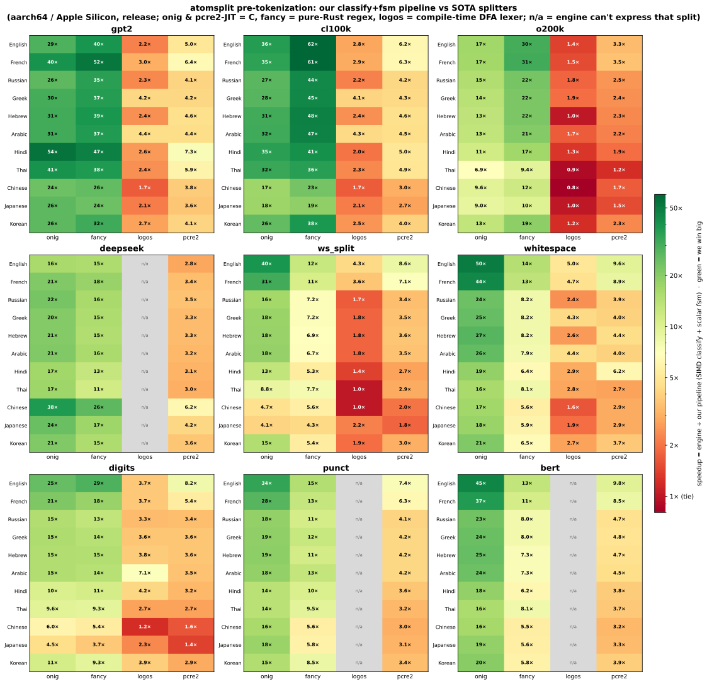

# Tag-classify pretokenization — design spec
The key design principle is to run 1 SIMD classification pass over the input, and then run a finite state machine on the produced tags.
SIMD first for the fsm is not great as unrolled regex can be quite complicated and cut often in many cases. The only SIMD you want in the fsm is when you are looking for `*` or `+` patterns. There, SIMD allows you to go fast to the last byte of the category you are looking for.
For simple pretokenizers like whitespace split that emit splits at tag boundary changes, simd can also be used.

We always have a scalar fallback for both the classification and the finite state machine.
## 1. The generic classify engine (composable lanes)
The key design principle is that no matter the number of atoms (well it has to be <255) the classifier does not change. The classifier operates on byte length. For each byte length we find a smart way to retrieve the class from pre-computed table. A new custom pre-tokenizer would only require us to update the table, never the classifiers. This scales really well as you can combine tags in the FSM to create bigger categories (like white space markers are whitespace and markers)

| lane          | lead byte range      | mechanism                                                              | shared SIMD ↔ scalar?              |
|---------------|----------------------|------------------------------------------------------------------------|------------------------------------|
| ASCII         | `0x00–0x7F` (1 B)    | 128-entry table, two 64-halves + subtract-trick `OR`                   | ✓ one table                        |
| 2-byte        | `0xC2–0xDF` (2 B)    | 8 groups × (4 sub × 64); **peel** the min group → one 256-lookup       | ✓ one table                        |
| CJK shortcut  | `0xE3–0xED` (3 B)    | range compares → one tag (current scheme folds all CJK → `Letter`)     | SIMD-only optimism (scalar → 3-byte) |
| 3-byte        | `0xE0–0xEF` (3 B)    | 512 blocks: 425 uniform const / 87 mixed 128-tables; **peel** blocks   | ✓ one table                        |
| cold BMP      | any BMP deferred     | run-length `(start_cp, tag)`, binary-searched (~1–3 KB)                | scalar reader / SIMD `MB`-fixup    |
| astral        | `0xF0–0xF4` (4 B)    | run-length `(start_cp, tag)`, binary-searched                          | scalar / SIMD stamps `MB` → fixup  |
| continuation  | `0x80–0xBF`          | tagged `Cont` — transparent to every FSM                               | ✓                                  |

The **13 coarse atoms** the default scheme emits (the coarse class is the tag's **low nibble**, so it fits in a `u4`; the whole engine works for any `< 255`):

```
0 Letter   1 NumWord   2 NumOther  3 Newline   4 Space    5 WsOther   6 Mark
7 Connector 8 Punct    9 Apostrophe 10 SymOther 11 NumericOther 12 Control
                                    ┌ internal sentinels, never seen by the FSM ┐
                                    13 Sentinel  14 MultiByte  15 Cont
```

The tag is a full `u8`: the **high nibble** is an optional *refinement* that sub-splits one coarse class for a pretokenizer needing finer granularity — without a second pass. o200k's case split refines `Letter` into `UPPER` (`\p{Lu}\p{Lt}`) / `LOWER` (`\p{Ll}`) / caseless, and `Mark` carries `ALPHA_SYM` for Other_Alphabetic symbols (`\w` but categorically `\p{S}`, e.g. circled letters). Coarse consumers collapse it for free — `in_mask` and the SIMD class path `& 0x0F` off the nibble — so only the FSM that opted in (o200k) ever sees it.

### 1.1 The only thing you need to know: how UTF-8 lays out a codepoint

Every table is indexed straight off the raw UTF-8 bytes, so the whole scheme falls out of the encoding. `x`/`y`/`z` are the payload bits of the codepoint; the `0`/`10`/`110`/`1110` prefixes are UTF-8's length tag:

```
             ├────────────── codepoint bits ──────────────┤
1 byte   0xxxxxxx                                            U+0000 .. U+007F   (ASCII)
2 byte   110xxxyy 10yyyyyy                                   U+0080 .. U+07FF
3 byte   1110xxxx 10yyyyyy 10zzzzzz                          U+0800 .. U+FFFF   (BMP)
4 byte   11110www 10xxxxxx 10yyyyyy 10zzzzzz                 U+10000 .. U+10FFFF (astral)
         └──┬───┘ └──┬───┘
          lead     continuation bytes (all start 10……)
```

Read a single byte and its **top bits tell you the lane**:

```
byte & 0x80 == 0x00  → 0xxxxxxx  ASCII                 (1-byte)
byte & 0xC0 == 0x80  → 10xxxxxx  continuation           → Cont
byte & 0xE0 == 0xC0  → 110xxxxx  2-byte lead
byte & 0xF0 == 0xE0  → 1110xxxx  3-byte lead
byte & 0xF8 == 0xF0  → 11110xxx  4-byte lead
```

### 1.2 How the tables are built (`bitmap_gen`, one source of truth)

We never hand-write a table. We **synthesize every byte sequence a lane can hold, decode it back to a codepoint, and ask the reference `atom(char)` for its class** — then store that class at the index the raw bytes produce. Because the *decode* and the *index* both come from the same bit layout above, the runtime lookup is exact by construction. One reference function → every table (and the SIMD kernel) derived from it; the generator then re-derives all 1.1 M codepoints and asserts the packed tables read back identically, so a scheme change that breaks a table fails the build.

```
for every byte pattern of the lane ──► cp = decode(bytes) ──► atom(char::from(cp)) ──► table[index(bytes)] = tag
                                        (§1.1 layout)          (the ONE reference)      (same layout → same index)
```

### 1.3 Per-lane mechanics

**ASCII — one 128-entry table, split in two halves.** NEON's table op (`vqtbl`) resolves ≤ 64 entries, so 128 needs two. The subtract trick makes one 8-bit index hit exactly one half (out-of-range lookups return 0, so the `OR` is clean):

```
tag(v) = tbl64(ascii_lo, v)  OR  tbl64(ascii_hi, v - 64)
         └ v<64 → lo[v]          └ v≥64 → hi[v-64]
         └ v≥64 → 0 (oob)        └ v<64 → v-64 wraps huge → 0 (oob)

v=5   : lo[5]      | (5-64 wraps → 0)   = lo[5]
v=65  : (65 ≥64→0) | hi[1]              = hi[1]
```

**2-byte — `110xxxyy 10yyyyyy`, 8 groups × 4 sub-groups × 64.** There are only 32 possible leads (`C0..DF`). Split the 5 lead payload bits into `xxx` (group, 8) and `yy` (sub-group, 4); the continuation's `yyyyyy` is the offset (64):

```
lead 110 x x x y y      cont 10 y y y y y y
        └─┬─┘ └┬┘                └──┬───┘
        xxx    yy                yyyyyy
       group  subgroup            offset
      (b0>>2)&7  b0&3             b1&0x3F

lookup:  group_tables[ xxx ][ yy ][ yyyyyy ]        ← declared [8][4][64]
in SIMD: the inner [4][64] is 256 contiguous bytes, so ONE 256-lookup does it,
         indexed by group_index = (yy<<6) | yyyyyy :
             idx 0..63  → sub 0     idx 128..191 → sub 2
             idx 64..127 → sub 1    idx 192..255 → sub 3      (subtract-window OR of 4×vqtbl4)
```

**3-byte — `1110xxxx 10yyyyyy 10zzzzzz`, 512 blocks, most of them a single tag.** A *block* = one lead (`E0..EF`, 16) × the high bits of the 2nd byte (`b1>>1`, 32) = 512 blocks, each covering 128 codepoints. Real scripts are homogeneous: `425 / 512` blocks are **one atom** (all of CJK Han is `Letter`, whole symbol ranges are `SymOther`), stored as a single const byte; only `87` "mixed" blocks (e.g. a script interleaved with its punctuation) need an actual 128-entry table.

```
1110 x x x x   10 y y y y y y   10 z z z z z z
     └──┬──┘       └┬┘└───┬──┘      └───┬────┘
      lead        b1-pair  (unused here) within-block offset
   E0..EF (16)   (b1>>1)&0x1F (32)        (b1&1)<<6 | z (128)

block = (lead-0xE0)*32 + ((b1>>1)&0x1F)            ── 512 of them
fast3_uni[block] = tag           if the whole 128-cp block is one atom   (425 blocks — just a const)
                 = 0xFF          otherwise → fast3_mixed[ fast3_slot[block] ] holds a 128-table (87 blocks)
```

**CJK shortcut (SIMD only).** The current scheme folds all of CJK to one tag (`CJK_TAG = Atom::Letter`), so the SIMD kernel skips the tables for `E3..ED` and proves "is CJK" with a few range compares (Han `E4..E9`, Hangul `EB..EC`, kana `E3 81..83`, minus a handful of punctuation holes like `・`). It only ever *under*-claims (boundary/hole codepoints fall through to the exact 3-byte tables), so it stays byte-exact. (A scheme that split CJK into distinct tags would drop this shortcut and use the tables.)

**Cold fallback + astral.** The dense BMP tag stream and the astral range are **run-length encoded** `(start_cp, tag)` and binary-searched — a few KB instead of a 64 KB dense LUT, because tags change rarely across a codepoint range. The SIMD kernel can't see a 4-byte char's 4th byte (it only gathers 3 bytes per lane), so it stamps those lanes `MB` and a per-chunk fixup resolves them via these tables while the chunk is still hot in L1.

### 1.4 Why "peel" and not "loop the range"

For 2-byte and 3-byte a chunk may hold lanes from several blocks. Instead of looping every block id between the min and max present (wasting a step per empty gap), we **peel**: `vminvq` the smallest block still unresolved → resolve exactly its lanes with one lookup → mask them out → repeat. Steps = **distinct blocks present** (usually 1 → that's the fast path), independent of how far apart the scripts sit, and no bounds guard. See `src/simd_classify.rs` for the annotated kernel.

## 2. The FSM: classify is nearly free, so the FSM *is* the cost

The single SIMD classify pass is ~free — **~0.05 ns/B on ASCII, ~0.3–0.6 on multibyte** (a handful of table lookups per 16 bytes). The pre-tokenizer's real cost is the **FSM** that turns the tag stream into spans: **~1–3 ns/B on dense Latin/code** (many short tokens ⇒ many state transitions) down to **~0.3 on run-heavy CJK**. So all the performance work lives here. The FSM writes spans into a **caller-owned `&mut [Span]` and returns the count** — no `Vec`, no realloc; the buffer is reused across calls.

### 2.1 A class is a `u16` bitmap

The classifier hands the FSM a stream of atom ids (`0..12`). A **class** is just a *set of atoms*, and a set of ≤ 16 atoms is one `u16` where **bit `t` = "atom `t` is in this class"**:

```
bit  : 12 11 10  9  8  7  6  5  4  3  2  1  0
atom : Ct Nu Sy Ap Pn Cn Mk Ws Sp Nl No Nw Lt      (Ct=Control Nu=NumericOther Sy=SymOther
                                                    Ap=Apostrophe Pn=Punct Cn=Connector Mk=Mark
                                                    Ws=WsOther Sp=Space Nl=Newline No=NumOther
                                                    Nw=NumWord Lt=Letter)
WS   :  .  .  .  .  .  .  .  1  1  1  .  .  .   = 0x0038   (Newline | Space | WsOther)
WORD :  .  .  .  .  .  1  1  .  .  .  .  1  1   = 0x00C3   (Letter | NumWord | Mark | Connector)
```

Building and testing a class are one instruction each — no branches, no table:

```rust
Atom::WsOther.bit()          // = 1 << 5                     build a class by OR-ing atoms
in_mask(tag, WS)             // = WS & (1 << tag) != 0       test membership: one AND + compare
```

A class is any union of atoms — `PUNCT_SYM = Connector|Punct|Apostrophe|SymOther`, `LETTER_MARK = Letter|Mark` — composed *without touching the classifier or re-running classification*. Add a 14th atom and every FSM keeps working; `u16` covers 16 atoms, and the exact same code with a `u32`/`u64` mask covers 32/64 classes for free (the classifier already emits arbitrary `u8` tags).

### 2.2 The scalar ↔ SIMD duality — SIMD only earns its keep on run-ends

A pre-tokenizer rule is one of two shapes, and **SIMD only helps the second**:

1. **Per-char decisions** — cl100k's contraction peek (`'s|'t|…`), the ` ?` / `[^…]?` prefix logic: a branchy little automaton, one char at a time. Branches don't vectorize, so this stays **scalar**.
2. **Run-ends — a `+`/`*` over one class** (`\p{L}+`, `\s+`, `\p{N}+`, a punct run): grab the maximal run. The trick is **skip the invalid, stop only at the valid**. The regex-shaped FSMs (`fsm_cl100k`, `fsm_o200k`, …) do this with the scalar `run_end`: it unrolls **16 tags per chunk** (one bounds check, `get_unchecked` reads), so a 3-char English word finishes in the ≤16-byte scalar tail while a long CJK run skips whole chunks. The *SIMD* form of the same idea lives only in the class family's `class_runs_neon` (below): `vqtbl1` a 16-tag membership LUT, `vminvq == 0xFF` ⇒ all 16 still in-run ⇒ skip the chunk.

The **dual** of a run-end is a **boundary**: the class-family pre-tokenizers (Whitespace / Bert / Digits / Punctuation) cut at *every* class change, so `class_runs_neon` scans the other way — classify 16 lanes (`vqtbl1`), fill continuation lanes from the left, `movemask` the class-changes, and iterate the set bits to emit one span per segment. It finds **every boundary in a chunk at once**, so short-run text (English words, ~5 chars) is never paid per-char.

Both fuse in one kernel: `class_runs_neon` first tries the run-end fast path — *whole 16-chunk stays the current class → skip it, no boundary work* — and only movemasks the **mixed** chunks. So it bulk-skips long runs (Digits/Punct/CJK) **and** parallel-boundaries the dense ones, byte-exact with the portable `emit_class_spans` oracle. Two views of the same idea: **run-end skips the invalid to reach the next valid; boundary-extract flags every valid at once.**

### 2.3 Why it's a finite-state machine

Each pre-tokenizer is a small automaton over the shared tag alphabet: a few **states** (in a letter run, inside whitespace, at a boundary) and, per incoming tag, a **transition** — extend the run, emit the span, or start a new one. The class masks *are* the transition predicates (`in_mask(tag, LETTER)` = "stay in the letter state"). So cl100k, GPT-2, whitespace-split, deepseek… are all the *same* machine driven by different masks + a few peeked bytes; only the states that are a maximal `+`/`*` run get the SIMD run-end.

## 3. Measured performance

Single-thread, **180 KB per language** (uniform size → comparable cache behaviour), **min-of-7 trials**, 14-core Apple Silicon (8 P + 6 E), light background load. `ns/byte`, lower is better. **Every row is byte-exact ✓** against the reference regex (onig for gpt2 / cl100k / o200k; the composed onig×3 `Sequence` for deepseek). Reproduce with `cargo bench --bench regex` (every pre-tokenizer × the four reference engines — the §3.0 chart); the class family's scalar-vs-SIMD boundary extractor is `--bench class_runs`, classify alone is `--bench classify`.

### 3.0 At a glance — vs every SOTA splitter

The `regex` bench pits the full pipeline (SIMD classify + scalar FSM) against **four** reference engines —
**onig** and **pcre2** (with JIT), both C; **fancy-regex**, pure-Rust; and **logos**, a compile-time DFA
lexer-generator — for each pre-tokenizer × language. Speedup = engine ÷ our pipeline; **green = we win big,
red = a close race**:



We lead on every pre-tokenizer — **~4–60×** vs onig/fancy and **~1.4–10×** vs the JIT / DFA engines — the
only near-ties being **o200k on CJK** (its case-split FSM is heavy there). `n/a` marks a split the engine
can't express: logos has no look-ahead, so deepseek's 3-regex `Sequence` and the punctuation-isolation
splits (punct / bert) have no single-grammar logos form. The GPT FSMs are byte-exact with their regex
(✓); the class-family reference regex is an approximation of the atom mask (`≈` where it diverges), so
those rows are a speed pairing rather than an equality gate. Regenerate:

```sh
cargo bench --bench regex > bench.txt
python3 benches/heatmap.py bench.txt benches/pretok_heatmap.svg   # needs matplotlib + numpy
```

### 3.1 cl100k — classify is ~free, the FSM is the cost

The regex-shaped FSMs are scalar (there is no SIMD cl100k FSM — SIMD lives only in the class family's `class_runs_neon`, §2.2). `pipeline = SIMD classify + scalar FSM`.

| lang | b/tok | classify | FSM (scalar) | onig | pipeline **vs onig** |
|---|--:|--:|--:|--:|--:|
| English  |  4.6 | **0.068** | 1.037 | 36.3 | **32.9×** |
| French   |  5.1 | 0.158 | 0.836 | 35.9 | 36.1× |
| Russian  | 10.2 | 0.315 | 0.462 | 20.7 | 26.6× |
| Greek    |  9.9 | 0.296 | 0.462 | 22.3 | 29.3× |
| Hebrew   |  8.3 | 0.302 | 0.481 | 24.2 | 30.9× |
| Arabic   |  9.1 | 0.293 | 0.499 | 23.6 | 29.8× |
| Hindi    |  5.3 | 0.320 | 0.659 | 39.9 | 40.7× |
| Thai     | 11.8 | 0.327 | 0.416 | 23.0 | 30.9× |
| Chinese  | 19.3 | 0.601 | 0.289 | 14.4 | 16.2× |
| Japanese | 25.3 | 0.715 | 0.265 | 14.1 | 14.4× |
| Korean   |  7.4 | 0.440 | 0.617 | 26.6 | 25.1× |

Reading it: **classify ≪ FSM** — on dense Latin the FSM is ~5–15× the classify, so that's where the work is (§2). Pure-ASCII English classifies at **0.068** (the ASCII fast path skips whole chunks); accented Latin (French) and multibyte scripts leave that fast path so classify costs more. The FSM is *cheapest* on run-heavy CJK (Chinese/Japanese ~0.27 — long homogeneous runs skip fast via the unrolled `run_end`) and dearest on dense short-token Latin. The full pipeline (SIMD classify + scalar FSM) is **14–41× onig**.

### 3.2 GPT-2 (ByteLevel), o200k & deepseek — same story, other regexes

All byte-exact; full-pipeline speedup vs the reference regex (one `cargo bench --bench regex` run covers all four families):

- **GPT-2 / ByteLevel**: **21–45×** onig (English 34×, Hindi 45×, Chinese 22×).
- **o200k** (GPT-4o — case-aware `[\p{L}\p{M}]+` split, so a heavier FSM): **7–18×** onig (English 17×, Thai 7×, Chinese 10×).
- **deepseek** (a `Sequence` of 3 Isolated splits, collapsed into one FSM): **17–41×** the composed onig×3 (Chinese 41×, Japanese 28×, English 17×).

### 3.3 Thread scaling (cl100k, ~16 MB doc, newline-partitioned seams)

Threads spawned once (`std::thread::scope`, no external dep); each chunk's seam sits after a whitespace-run's last `\n`, so no token crosses it — **byte-exact for cl100k/deepseek** (proven: partitioned spans == sequential). MB/s (bytes×iters / wall; illustrative from a prior run — thread scaling has no standalone bench target in the current layout):

| threads | English | | Chinese | |
|--:|--:|--:|--:|--:|
| 1  |   474 | 1.00× |   818 | 1.00× |
| 2  |   934 | 1.97× |  1580 | 1.93× |
| 4  |  1883 | 3.98× |  2998 | 3.66× |
| 8  |  3739 | 7.90× (99% linear) |  5698 | 6.96× |
| 14 |  4814 | 10.2× |  7229 | 8.83× |

**~99% linear through the 8 performance cores**; the drop at 14 is the 6 efficiency cores (slower, so "% linear" falls — not contention). A single un-splittable long document uses the overlap-chunk path instead (BPE/pretok locality — see the merge notes).
